<div align="center">

```text
╭──────────────────────────────────────────────────────────────╮
│                                                              │
│                          PHANI RAM                           │
│                          PR//WORKSPACE                       │
│                                                              │
│                       Developer Dashboard                    │
│         FULL STACK ENGINEER • OPEN SOURCE CONTRIBUTOR        │
│                                                              │
╰──────────────────────────────────────────────────────────────╯
```




<p align="center">
	
	
	
</p>

```text
╭──────────────────────────────────────────────────────────────╮
│ PR//WORKSPACE INITIALIZATION                                 │
├──────────────────────────────────────────────────────────────┤
│ [ OK ] Loading React                                          │
│ [ OK ] Loading Node.js                                        │
│ [ OK ] Loading Express                                        │
│ [ OK ] Loading MongoDB                                        │
│ [ OK ] Connecting GitHub                                      │
│ [ OK ] Syncing Open Source Projects                           │
│ [ OK ] Workspace Ready                                        │
╰──────────────────────────────────────────────────────────────╯

████████████████████████████████████████████████████████████ 100%

> phani@workspace:~$ _
```

<!-- whoami -->

```text
╭──────────────────────────────────────────────────────────────╮
│ $ whoami                                                     │
├──────────────────────────────────────────────────────────────┤
│ Name        : PHANI RAM                                       │
│ Role        : Full Stack Engineer                             │
│ Location    : India 🇮🇳                                       │
│ Education   : B.Tech Computer Science                         │
│ Learning    : Full Stack Development                          │
│ Interests   : Web Development • Open Source • UI/UX           │
│ Mission     : Building scalable and meaningful software.      │
╰──────────────────────────────────────────────────────────────╯
```

I build modern web applications with a focus on clean UI/UX and pragmatic engineering.  
I enjoy contributing to open source and collaborating on meaningful projects.  
I continuously learn new tools and patterns to deliver reliable, maintainable systems.  
I care about clarity, developer experience, and solving real user problems.  

<!-- Engineering Stack -->

**Engineering Stack**

## Languages


HTML • CSS • JavaScript • Python • Java

## Frontend


HTML • CSS • Tailwind CSS

## Backend


Python • Flask

## Databases


MySQL

## Tools


Git • GitHub • VS Code • Figma

## Currently Learning


Full Stack Development • Data Structures & Algorithms • System Design

<!-- Featured Projects -->

## Featured Projects

**MediScan**  
*AI-powered Medical Test Report Analyzer — extracts key metrics from lab reports, highlights anomalies, and provides clinician-friendly summaries.*  
  
**Tech:** Python • Flask • HTML • CSS • JavaScript  
  
[Repo](#) · 

---

**Kalayatra**  
*Creative brand website presenting a time‑travel inspired clothing collection with responsive design and visual storytelling.*  
  
**Tech:** HTML • CSS  
  
[Repo](#) · [Live Demo](#)

---

**Coffee Menu**  
*Responsive coffee shop landing page showcasing menu, locations, and a mobile-first ordering demo.*  
  
**Tech:** HTML • CSS  
  
[Repo](#) · [Live Demo](#)

---

**More Projects Coming Soon**  
*Polished showcases and open-source contributions arriving soon.*  
  
**Tech:** —  
  
 · 

<!-- Development Metrics -->

## Development Metrics

<p align="center">


</p>

<p align="center" style="margin-top:12px;">


</p>

> *"Learning every day. Building one project at a time."*

<!-- GitHub Statistics -->

## GitHub Statistics

<p align="center">
	
	&nbsp;&nbsp;
	
</p>

<p align="center">
	
</p>

<p align="center">
	
</p>

<!-- Achievements -->

## Achievements

<p align="center">
	
</p>

> *"Consistent learning. Meaningful contributions. Better engineering every day."*

</div>

